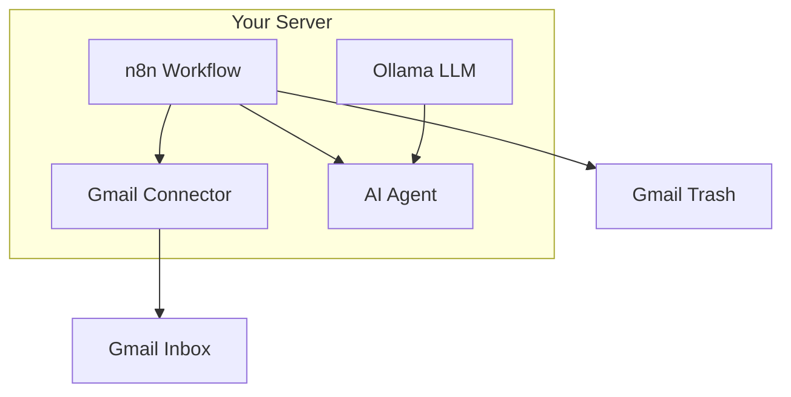
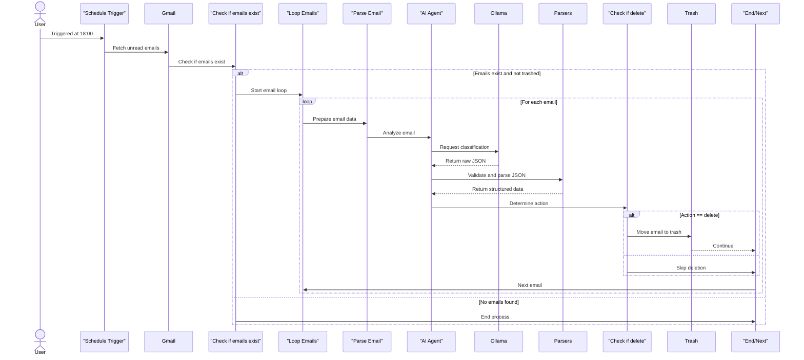

# Simplify Your Gmail Inbox Using Self-Hosted n8n with Ollama LLM

## Table of Contents
- [Overview](#overview)
- [Purpose](#purpose)
- [Context](#context)
- [Structure](#structure)
- [Key Features](#key-features)
- [Getting Started](#getting-started)
  - [Prerequisites](#prerequisites)
  - [Deployment](#deployment)
  - [Testing](#testing)
  - [Go-Live Guide](#go-live-guide)
- [Architecture Diagram](#architecture-diagram)
- [Swimlane Diagram](#swimlane-diagram)
- [CI/CD Pipeline Diagram](#cicd-pipeline-diagram)
- [Sequence Diagram](#sequence-diagram)

---

## Overview
Automate Gmail inbox management using **self-hosted n8n** (workflow automation) and **Ollama LLM** (local AI) to filter spam, categorize emails, and reduce manual effort—all while keeping data private.

    
## Purpose
- **Eliminate inbox clutter** with AI-powered sorting.
- **Self-hosted solution** for privacy-conscious users.
- **No-code/low-code** setup using n8n’s visual workflow builder.

## Context
Traditional email filters (e.g., Gmail rules) lack AI smarts and require cloud-based APIs. This project combines:
- **n8n**: Open-source automation.
- **Ollama**: Local LLM (e.g., Llama 3, Qwen) for email analysis.

## Structure
1. **n8n Workflow**: Scheduled triggers → Gmail API → Ollama LLM → Actions (delete/label).
2. **Ollama Integration**: Processes emails locally (no data leaks).

## Key Features
✅ **AI Categorization**: Classifies emails as Promo/Spam/Important.  
✅ **Self-Hosted**: No reliance on cloud AI (e.g., OpenAI).  
✅ **Automated Actions**: Auto-delete trash, label urgent emails.  
✅ **Customizable**: Adapt workflows to your needs.  

---
### Sequence Diagram


## Getting Started

### Prerequisites
- **Server**: Linux VPS (2GB+ RAM, Docker).
- **Accounts**:
  - Gmail (with IMAP/API access).
  - Ollama (local or server install).

### Deployment
1. **Install Ollama**:
   ```bash
   curl -fsSL https://ollama.com/install.sh | sh
   ollama pull llama3

   Deploy n8n (Docker):

bash
docker run -d --name n8n -p 5678:5678 -v ~/.n8n:/home/node/.n8n n8nio/n8n
Configure Workflow:

Import the provided JSON workflow into n8n.

Set up Gmail/Ollama credentials in n8n.

###Testing
Trigger a test email.

Verify Ollama’s classification (check n8n execution logs).

Confirm actions (e.g., spam moved to trash).
